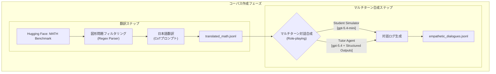
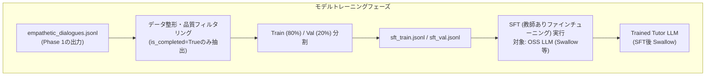
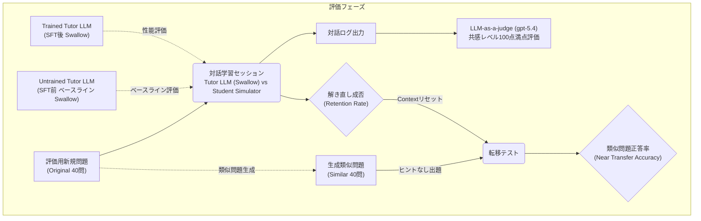

# Empathetic AI Tutor (empathetic-AItutor)

本プロジェクトは、大規模言語モデル（LLM）の高度な役割演技（Role-playing）シミュレーションを利用し、学習者の認知状態と感情をリアルタイムで推論・追尾する「共感的・動的足場かけ（Dynamic Scaffolding）」数学対話データセットを自動合成、およびモデル評価を行うパイプラインです。

単なる正誤判定や答えを即座に提示する解答者（Solver）としてのパラダイムを超え、学習者の自発的な気付きを促す次世代の「教育型LLM（Tutor）」を構築するためのSFT（教師ありファインチューニング）用コーパスの創出と、その教育的知性の定量的検証を目的としています。

---

## 学術的背景とアプローチ

### 1. 開発の背景と課題
近年、LLMを活用した動的な対話型学習支援システムが注目を集めていますが、従来のシステムは単に正解や詳細な解説を一方的に出力する「Solver」としての性能に偏重しがちです。これは、学習者の理解を段階的に深める「Tutor」としての教育的知性（Pedagogical Intelligence）の実装という観点において大きな課題を残しています。本研究では、提示された数学の問題をあえて細分化し、生徒が自力で乗り越えられる最近接領域（ZPD: Zone of Proximal Development）のステップのみを部分的に提示する「動的足場かけ」の自動化によってこの課題の解決を図ります。

### 2. 認知的共感と感情制御
教育対話においてチューターが表出するべき共感は、単なる同情や慰め（感情的共感）ではなく、学習者が「なぜそのエラーを起こしたのか」「どこで迷っているのか」を論理的に解釈し、そのつまずきを正常化（Normalize）する「認知的共感（Cognitive Empathy）」である必要があります。本システムでは、D'Melloらの学習感情サイクル（Affective Learning Cycles）をベースとした動的な感情トラッキングを実装し、生徒モデルが Frustrated（苛立ち）や Bored（退屈・思考放棄）に接近するほど、教師モデルが認知的共感を動的に強めてモチベーションを制御・維持する機構を組み込んでいます。

### 3. 教育的フィードバック
適切なトーンや十分な情報網羅性を備えた教育的フィードバックの生成は、学習者の深い概念理解の促進において極めて有意です。本アーキテクチャでは、教師モデルに強力な Chain of Thought (CoT) を義務付けています。発話を生成する前に、必ずシステム側で「生徒のつまずき原因のデバッグ」と「次の一歩の計画」を論理的に推論させる（メタ推論）プロセスを強制することで、洗練された教育的フィードバックの自動アノテーションを実現しています。

### 4. LLM-as-a-judge
教育的知性や共感性といった定性的な対話品質は、BLEUやROUGEなどの従来のテキスト一致度メトリクスでは評価が困難です。本研究では、最先端の推論モデルを用いた LLM-as-a-judge 手法を採用し、厳格な評価ルーブリックに基づくスコアリングを行うことで、モデルの「感情認識精度」と「教育的共感の適切さ」を客観的かつ定量的に評価するアプローチをとっています。

---

## パイプライン・アーキテクチャ

本研究のアーキテクチャは、データの自動合成、モデルのファインチューニング、そしてシミュレーション環境における性能評価の3つのフェーズがシームレスに統合されたエンドツーエンドのパイプラインです。以下にその正確なフローを示します。

### 1. コーパス作成フェーズ (Phase 1: Corpus Creation)

### 2. モデルトレーニングフェーズ（Phase2:Model Training）

### 評価フェーズ（Phase3:Evaluation）

### コーパス作成フェーズ (create corpus/)
Step 1: データセットのフィルタリングと日本語翻訳 (`translate_dataset.py`)
* **データソース**: Hugging Faceの `nlile/hendrycks-MATH-benchmark` を使用します。
* **フィルタリング**: テキストベースの対話シミュレーションに適さない図形問題などを、正規表現を用いて自動的に排他・フィルタリングします。
* **翻訳処理**: `translator_system.txt` のCoTプロンプトにより、数式や論理構造を維持したまま、自然な日本語の問題文・解答へと高精度に翻訳し、`translated_math.jsonl` として出力します。

Step 2: 役割演技（Role-playing）によるマルチターン対話合成 (`GM_completionsAPI.py`)
* **User Simulator (Student Model)**:
  * `gpt-5.4-mini` を採用し、ターゲットとなる生徒のプロファイル（学年、既習範囲、苦手な領域、ミスしやすい傾向）と、問題に応じた感情遷移ルール（`student_system.txt`）をインプットしてシミュレートします。
* **Tutor Agent (Teacher Model)**:
  * `gpt-5.4` を採用し、指導戦略プロンプト（`teacher_system.txt`）に従って動作します。
  * OpenAI APIの **Structured Outputs (`strict: true`)** 機能を活用し、チューターの思考ログ、感情分類、および最終発話を厳密なJSON Schemaで制御・抽出します。

### モデルトレーニングフェーズ (eval model/prepare_sft_dataset.py)
生成された対話データの中から、生徒が最終的に正解に到達した（is_completed: true）高品質なセッションのみをフィルタリングし、学習用と検証用に分割してSFTフォーマットに整形します。このデータを基にオープンモデル（例：Swallow等）をファインチューニングします。

### 評価フェーズ (eval model/evaluate_by_simulator.py)
SFT前後のモデルを教師役とし、シミュレータ環境で新規問題に対する指導を行わせます。対話ログから「共感性」を評価するフェーズと、文脈をリセットして類似問題を出題し「概念の定着度」を評価するフェーズの2段階で定量的検証を行います。

---

## 主要なデータ構造とスキーマ

### 1. 教師モデルの応答スキーマ (Structured Outputs)
教師モデルは毎ターン、以下のオブジェクト構造を厳密に遵守して出力を生成します。

| プロパティ名 | 型 | 説明 |
| :--- | :--- | :--- |
| `thought_process` | `string` | 生徒のつまずき原因、現在の感情状態、およびどのような足場かけが必要かのメタ推論プロセス（CoT） |
| `student_emotion` | `string` | トラッキングされた生徒の現在の感情（後述の11クラスから選択） |
| `roadmap_breakdown` | `string` | 目標達成（問題解決）までに必要なステップの分解ロードマップ |
| `next_step_plan` | `string` | このターンで提示する具体的な動的足場かけのアプローチ計画 |
| `is_completed` | `boolean` | 生徒が自力で正解に到達し、対話セッションを終了してよいかどうかのフラグ |
| `teacher_utterance` | `string` | 生徒に提示される、認知的共感と言語的足場かけを含んだ最終的な指導発話テキスト |

### 2. トラッキングする感情クラス 
学習科学の文脈に基づき、以下の10種類の感情状態を動的に追尾します。
* **ポジティブ / 促進的状態**: `Engaged`（没頭）, `Curious`（好奇心）, `Eureka`（アハ体験・突然の理解）, `Proud`（誇らしい）, `Relieved`（安心）
* **ニュートラル**: `Neutral`（中立）
* **ネガティブ / 阻害的状態（チューターの介入対象）**: `Confusion`（混乱）,  `Frustrated`（苛立ち・フラストレーション）, `Bored`（退屈・思考放棄）, `Anxious`（不安）

---
## 評価パイプライン

評価は、チューニング後の教師モデルと「評価用生徒シミュレータ（LLM）」との間のインタラクティブな対話を通じて、以下の2つのフェーズ（1セッション）で実行されます。

#### 対話学習フェーズ (Phase 1)
* **タスク**: 教師モデル（SFT後モデル）が評価用問題（40問）を生徒シミュレータに出題し、生徒のつまずきや負の感情（`Frustrated` / `Confusion`）に対応しながら足場かけ（Scaffolding）を行います。
* **測定指標**:
    * **解き直し正答率 (Retention Rate)**: 先生の誘導によって、最終的に元の問題を自力で解き切ることができたセッションの割合。
    * **共感レベル (Empathy Score)**: 出力された対話ログを高性能LLM（GPT-4o等）に Judge させ、教師モデルが「生徒の感情を正確にトレースできているか（感情認識精度）」「エラーの正常化や適切なフォローを行えているか（認知的共感）」をルーブリックに基づいて自動評価します。

#### 転移テスト (Phase 2)
* **タスク**: Phase 1の対話が終了した**直後**、コンテキストを一度クリア（文脈を完全分離）し、学習した概念を応用できるかを試す「類似問題」を生徒シミュレータに単発で出題します。
* **測定指標**:
    * **類似問題正答率 (Near Transfer Accuracy)**: 教師のリアルタイムなヒントがない状態で、直前の対話で得た知識を新しい問題に正しく応用できたかの割合。これにより、システムが単にその場限りの答えを教えたのか、それとも概念を理解させたのかを定量化します。

---

### 評価ルール (LLM-as-a-judge Criteria)
中央化バイアスを防ぐため、100点満点のスコアリングとして以下のルーブリックに基づいて評価を行います。

| 評価軸 | 判定カテゴリ | 定義・言語シグナル基準 |
| :--- | :--- | :--- |
| **感情認識精度**<br>*(Emotion Alignment)* | **[Good]**<br><br>**[Bad]** | 生徒が投げやり（`Frustrated`）または自信なさげ（`Confusion`）なトーンを示した際、`<analysis>`内の予測感情が一致している。<br><br>生徒が明らかに苛立っているにもかかわらず、数学的進捗のみを見て `Engaged` や `Neutral` と誤認識している。 |
| **教育的共感**<br>*(Pedagogical Empathy)* | **[Excellent]**<br><br><br>**[Acceptable]**<br><br>**[Reject]** | 負の感情に対し「最初は難しいよね」等のエラーの正常化（心理的安全性の確保）を行い、同時にヒントを細分化している。<br><br>感情への明示的な寄り添いはないが、認知負荷を下げるために論理的かつ丁寧な足場かけを行っている。<br><br>生徒の不満やパニックを無視して冷たく計算を要求する、または答えをそのまま教えて思考機会を奪っている。 |
| **対話長制御**<br>*(Length Control)* | **[Pass]**<br><br>**[Fail]** | 生徒の認知負荷を考慮し、1〜2文の簡潔な問いかけに抑えられている。<br><br>3文以上の解説長文になっており、一度に多くの認知負荷を強いている。 |

---

## 技術スタック

* **Language**: Python 3.12+
* **Package Manager**: `uv`（高速な仮想環境構築・依存関係同期）
* **LLM API & Infrastructure**:
  * OpenAI API (`client.chat.completions.create`)
  * 推論モデル: `gpt-5.4`（Teacher / Translator 用）, `gpt-5.4-mini`（Student Simulator 用）
  * 機能特性: Structured Outputs (`strict: true`) による構造化出力制御
* **Libraries**:
  * `datasets` (Hugging Face) : MATH ベンチマークのストリーミングロード
  * `tqdm` : 翻訳および対話シミュレーションの進捗可視化
  * `re` (標準正規表現ライブラリ) : 頑健なタグブロック（`[Thought Process]`, `[Q]`, `[A]`）の抽出

---

## ディレクトリ構成

```plaintext
empathetic-AItutor-workspace/
├── create corpus/                     # SFT用コーパス生成パイプライン
│   ├── prompts/                       # 生成用プロンプト群 (Teacher, Student, Translator等)
│   ├── questions/                     # MATHデータセット処理用スクリプト群
│   ├── translate_train_dataset.py     # 学習用問題の日本語翻訳スクリプト
│   ├── generate_corpus.py             # マルチターン対話合成コアスクリプト
│   ├── analyze_dataset.py             # 合成された対話の統計・感情分布分析ツール
│   └── corpus.jsonl / empathetic_dialogues.jsonl
│
├── eval model/                        # 評価シミュレータ及びSFT準備パイプライン
│   ├── prompts/                       # 評価用プロンプト群 (Phase1/2生徒, 100点満点Judge等)
│   ├── questions/                     # 評価用問題（Original 40問 / Similar 40問）生成機能
│   ├── translate_test_dataset.py      # 評価用新規問題の抽出・翻訳スクリプト
│   ├── prepare_sft_dataset.py         # SFTフォーマット整形・Train/Val分割スクリプト
│   ├── evaluate_by_simulator.py       # SFT前後のモデル性能を測る全自動評価シミュレータ
│   ├── sft_train.jsonl / sft_val.jsonl
│   └── evaluation_results.jsonl       # シミュレータによる最終評価出力
└── README.md
```

## 開発環境の構築と実行手順

### 1. 必要な環境変数
OpenAI API へのアクセスを制御するため、以下の環境変数を事前にエクスポートする必要があります。

```bash
export GPT_API_KEY="your_openai_api_key_here"
export OPENAI_BASE_URL="[https://api.openai.com/v1](https://api.openai.com/v1)"
```

### 2. セットアップ・コマンド
パッケージ管理ツール uv を用いて、高速かつクリーンに依存関係をインストールします。
```bash
pip install uv
uv pip install openai datasets tqdm
```

### 3. パイプラインの実行手順
Step 1: シードデータの作成（翻訳とフィルタリング）
Hugging Face から元の MATH ベンチマークを読み込み、日本語化されたシード問題集をビルドします。
```bash
python translate_dataset.py
```
* 実行が成功すると、カレントディレクトリに translated_math.jsonl が生成されます。

Step 2: 共感対話シミュレーション（マルチターン合成）の実行
生成された日本語問題をシードとし、生徒プロファイルを動的にマッピングしながらチューター対話をシミュレートします。
```bash
python GM_completionsAPI.py
```
* 最大15ターンの対話がロールプレイされ、最終的に CoT_emotional_cycle_sample.json として、CoT推論ログと感情ラベルが付与された高品質なSFT用コーパスが出力されます。

## 評価実験アーキテクチャ (Evaluation Architecture)

本プロジェクトでは、感情サイクルを考慮した数学教育対話システムの性能を多面的に検証する独自の評価フレームワークを採用しています。

### 1. データセット構成 (Dataset Split)

MATHデータセットから図形問題および視覚的参照を含む問題を厳格にフィルタリングし、以下のように学習・検証用プールと評価用プールを完全に独立させて管理します。

* **学習・検証用データ (既存プール: 計 184 問)**
    * **Train (80%)**: 約 147 問（マルチターン対話合成データセットの構築に使用）
    * **Validation (20%)**: 約 37 問（学習時の過学習監視およびハイパーパラメータ調整に使用）
* **評価用データ (完全新規プール: 計 40 問 + 類似問 40 問)**
    * **Original Test (40問)**: MATHデータセットの201番目（Index: 200）以降から新しく抽出・翻訳した、モデルにとって完全に初見の数学問題。
    * **Similar Test (40問)**: 上記40問の数学的構造（解法ロジック）を維持したまま、数値や文章題の設定のみをGPT-4oで変更した類似問題（転移テスト用）。

---

## 今後の展望・研究への応用 (Future Work)

本パイプラインによって合成されたデータセットは、以下のNLP・教育工学領域におけるコア研究に直接応用可能です。

### 1. 教育特化型LLMの教師ありファインチューニング（SFT）
ABCI 3.0環境を活用し、`Swallow` や `llm-jp` などのオープンな日本語大規模言語モデルに対してSFTを実行します。チューター発話（`teacher_utterance`）だけでなく、思考プロセス（`thought_process`）も含めてモデルに学習させることで、推論能力と認知的共感能力を同時に担保した実用的なAIチューターモデルの構築を目指します。

### 2. 对話コンテクストにおける感情遷移の定量的解析
提案する評価フレームワークを用い、チューニング前後のモデルにおける生徒の「感情のリカバリー率（`Frustrated` ➔ `Engaged` への遷移確率など）」をマクロに比較し、認知的共感が学習継続性に与える影響を定量化します。

### 3. マルチモダリティ・実対話への拡張
現在はテキストベースのシミュレーションですが、ここで構築した感情トラッキングのロジックを、音声のトーンや韻律、あるいは数式の手書き入力ステップと統合することで、より現実の指導現場に近い、真の「共感的AI Tutor」への発展を視野に入れています。

---

## 参考文献 (References)

### 和文文献 (Domestic Conferences)
* 鈴江 万碧, 堀尾 海斗, 折田 奈甫, 河原 大輔. (2025). 対話に対する共感のアノテーションと共感制御可能な対話モデルの構築. *言語処理学会 第31回年次大会 発表論文集*, pp. 4133-4136.
* 古橋 萌々香, 中山 功太, 児玉 貴志, 菅原 朔, 高見 享佑. (2026). LLM による教育的フィードバックの生成と評価. *言語処理学会 第32回年次大会 発表論文集*.
* 亀田 隆雅, 馬 青. (2025). LLM を用いた日本語学習者支援. *言語処理学会 第31回年次大会 発表論文集*.
* 井手 竜也. (2021). 生成と分類のマルチタスク学習による感情が考慮された対話応答生成. *言語処理学会 第27回年次大会 発表論文集*, pp. 643-646.

### 英文文献 (International Journals & Conferences)
* **[AutoTutor / Affective Computing]** D'Mello, S., & Graesser, A. (2012). AutoTutor and Affective AutoTutor: Learning by Talking with Cognitively and Emotionally Intelligent Computers that Talk Back. *ACM Transactions on Interactive Intelligent Systems (TiiS)*, 2(4), 1-39.
* **[KMP-Bench / Tutor Evaluation]** Shi, W., Ren, H., Pan, J., Zhou, A., Wang, K., Lu, Z., Yang, Y., Hu, Y., Wei, L., Zhan, M., & Li, H. (2026). From Solver to Tutor: Evaluating the Pedagogical Intelligence of LLMs with KMP-Bench. *arXiv preprint arXiv:2603.02775*.
* **[DialogXpert / Emotion-Aware Dialogue]** Rakib, T. B. A., Mehrish, A., Soon, L. K., Lim, W. H., & Poria, S. (2025). DialogXpert: Driving Intelligent and Emotion-Aware Conversations through Online Value-Based Reinforcement Learning with LLM Priors. *arXiv preprint arXiv:2505.17795*.
* **[Control-Value Theory]** Pekrun, R. (2024). Control-Value Theory: From Achievement Emotion to a General Theory of Human Emotions. *Educational Psychology Review*, 36(3), 83.
* **[Dialogue Tutoring System]** Perez, J., & Ong, E. (2024). Designing an LLM-Based Dialogue Tutoring System for Novice Programming. *Proceedings of the 32nd International Conference on Computers in Education (ICCE 2024)*.
* **[Pedagogical Agents]** Okonkwo, C. (2001). Affective Pedagogical Agents and User Persuasion. *Department of Computer Science, University of Saskatchewan*.
